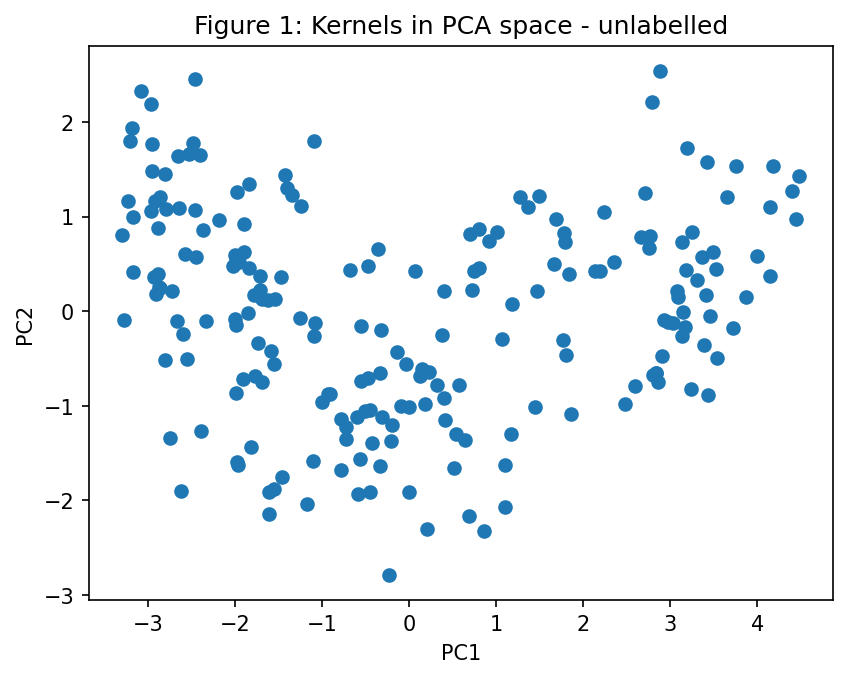
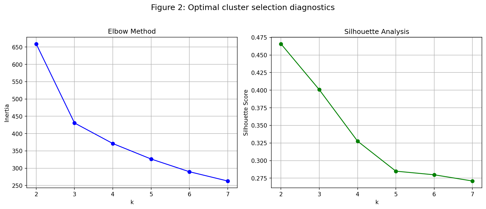
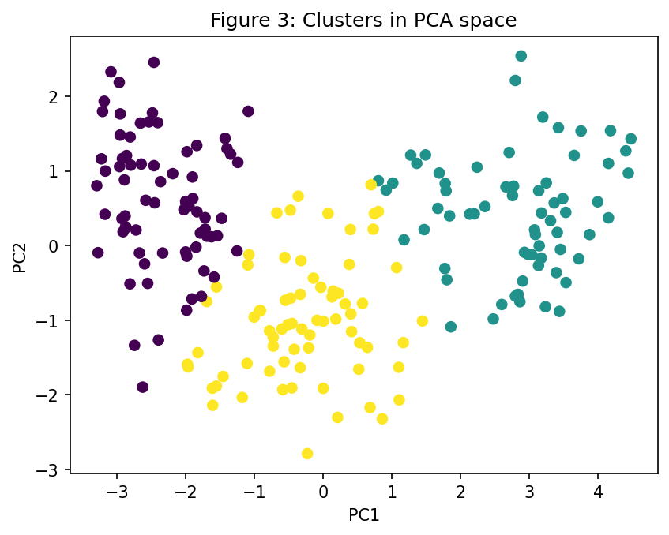
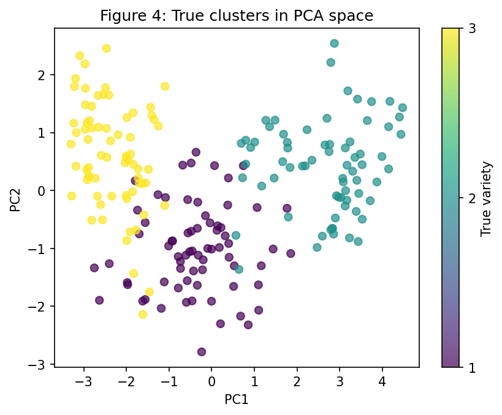

# Unsupervised clustering of wheat kernels: How much variety can k-means capture without the labels.
## 1. Problem
An agricultural co-op receives deliveries of mixed wheat grain and suspects it contains several distinct varieties, but the deliveries arrive unlabeled. Before investing in a labelling or sorting process, the co-op wants to know how many varieties are plausibly present and how cleanly they separate on a few simple measurements. This projects asks three questions: How can we find the seed clusters without using the existing labels, how well do those clusters much the ground truth, once the labels are revealed and what are the ethical complications of an overconfident reliance on the models predictions? 
## 2. Data
The seed dataset originally come from UCI Machine Learning Repository, collected at the Institute of Agrophysics of the Polish Academy of Sciences in Lublin. We load it from OpenML. It consists of 210 wheat kernels and 7 measurements. All measurements are numerical and there are no missing values. The labels are stored separately and are not used at any point during the clustering. There are 3 varieties with 70 kernels each.  
| Feature | Meaning |
|---------|---------|
| `area` | Area of the kernel |
| `perimeter` | Length of the kernel's outline |
| `compactness` | How close the shape is to a circle (4π·area / perimeter²) |
| `kernel_length` | Length of the kernel |
| `kernel_width` | Width of the kernel |
| `asymmetry` | Asymmetry coefficient of the kernel |
| `groove_length` | Length of the kernel groove |

## 3. Methods
The pipeline consists of the following steps:
1. Scaling: The initial exploration of the data showed that the features have very different scales. If left unchanged, the features with larger values would dominate any method based on distances. To prevent this, I standardised each feature with `StandardScaler`, so that each one has a mean of 0 and a standard deviation of 1.
2. PCA for visualisation: All seven feature dimensions cannot be visualised at once, so I reduced them to two principal components. The first captures 72% of the variance and the second 17%, which together account for 89% of the total. The first scatter plot was created without any labels, to see what structure is visible by eye. 
3. K-Means and choice of k: I used K-Means for clustering, testing k = 2 to 7 on the scaled data. I set `n_init=10` (ten random starting points, keeping the best result) and `random_state=42` for reproducibility. For every k, I recorded two diagnostics: inertia (the within-cluster sum of squared distances, used for the elbow plot) and the silhouette score (how well each point fits its own cluster compared with the nearest other cluster). I then plotted both diagnostics against k.
4. Evaluation: This is the only step where the labels are used. I used a cross-tabulation (a table counting how many kernels of each variety fell into each cluster) and the purity score (the number of kernels belonging to the most common variety in each cluster, summed over all clusters and divided by the total number of kernels). I also created a scatter plot coloured by the true labels, and cluster profiles based on the cluster centres converted back to their original units.

## 4. Results

The points form one elongated, continuous cloud, not clearly separated groups. About three denser regions are visible (left, middle, right), but with no clear gaps between them.

The silhouette score is highest at k = 2 (about 0.47) and falls to about 0.40 at k = 3. The elbow plot bends at k = 3: inertia drops sharply from 2 to 3 and much more slowly afterwards.

| Cluster | Variety 1 | Variety 2 | Variety 3 |
|---------|-----------|-----------|-----------|
| 0       | 6         | 0         | 66        |
| 1       | 2         | 65        | 0         |
| 2       | 62        | 5         | 4         |

Each cluster matches one variety: cluster 0 is variety 3, cluster 1 is variety 2 and cluster 2 is variety 1.

The plot coloured by true variety looks very similar to the cluster plot, with the differences at the borders.

Purity Score:0.919 
that means 193 of the 210 kernels are in the cluster dominated by their own variety and 17 are not.

**Cluster Profiles**
| Cluster | Area | Perimeter | Compactness | Length | Width | Asymmetry | Groove length |
|---------|------|-----------|-------------|--------|-------|-----------|---------------|
| 0       | 11.86 | 13.25 | 0.848 | 5.23 | 2.85 | 4.74 | 5.10 |
| 1       | 18.50 | 16.20 | 0.884 | 6.18 | 3.70 | 3.63 | 6.04 |
| 2       | 14.44 | 14.34 | 0.882 | 5.51 | 3.26 | 2.71 | 5.12 |

Cluster 1: the largest kernels on every size measure (area, perimeter, length, width, groove).
Cluster 0: the smallest kernels, the least compact and the most asymmetric.
Cluster 2: medium-sized kernels, with the lowest asymmetry.
Main driver: the clusters differ mostly by size, which fits PC1 carrying 72% of the variance.
Groove length: clusters 0 and 2 have almost the same groove length (5.10 and 5.12) despite different areas, so that feature only separates cluster 1.

## 5. Interpretation and limitations
Some of the most important observations are:
1. The clustering managed to recover most of the variety structure. Specifically, about 92% of kernels ended up in the right category. 
2. The varieties main difference is the kernel size, which also dominates the features (PC1=72%) and k-means was able to recognize this. 
3. The cleanest cluster is the variety 2 because they are the largest kernels. Variety 1 is the hardest, probably because of the medium size of the kernels. This is where 17 errors happened. The varieties 2 and 3 are never confused with each other, because they have very different sizes.
According to the above and the overlap of the points in figure 4, the mistakes of the model were expected. No methods using only these seven features could separate the kernels perfectly.

Some of the most important limitations are:
1. In a real life situation we wouldnt have the labels, so we wouldn't be able to measure the performance of the model.
2. Purity is not an ideal diagnostic test because it increased with the rise of k, for example it would be 1 for 210 clusters.
3. The choice of key was not clear. The cross-tabulation suggested k=3 and the silhouette score suggested k=2. We made a compromised based also on the visualization at the unlabeled PCA diagram.
4. k-means clustering assumes roughly round clusters. We could have different shapes or kernels that belong in more than one category.   

The ethical point of view:
Clusters should not be treated as perfect but rather as hypothesis and a guide. Otherwise the co-op could end up with lower quality products with cross contaminations. 

## 6. Possible improvements
1. I would use other clustering methods and see if the results are the same. For example, I could use Gaussian mixture models which allow elongated clusters and give each kernel a probability of belonging to each cluster or I could use hierarchical clustering which would show how the groups merge and as a result it gives another view of the k = 2 vs k = 3 question.
2. A good idea would be to create a simple supervised classifier (logistic regression) to work as a benchmark: if even a model that sees the labels reaches only about 93 to 95%, most of the 8% error is unavoidable overlap, not a weakness of K-Means.
3. I would repeat the K-Means with many random seeds, or on random subsamples, to check that the clusters stay the same.
4. I would add more metrics such as the adjusted Rand index, which, unlike purity, corrects for chance and doesn't rise automatically with k.

